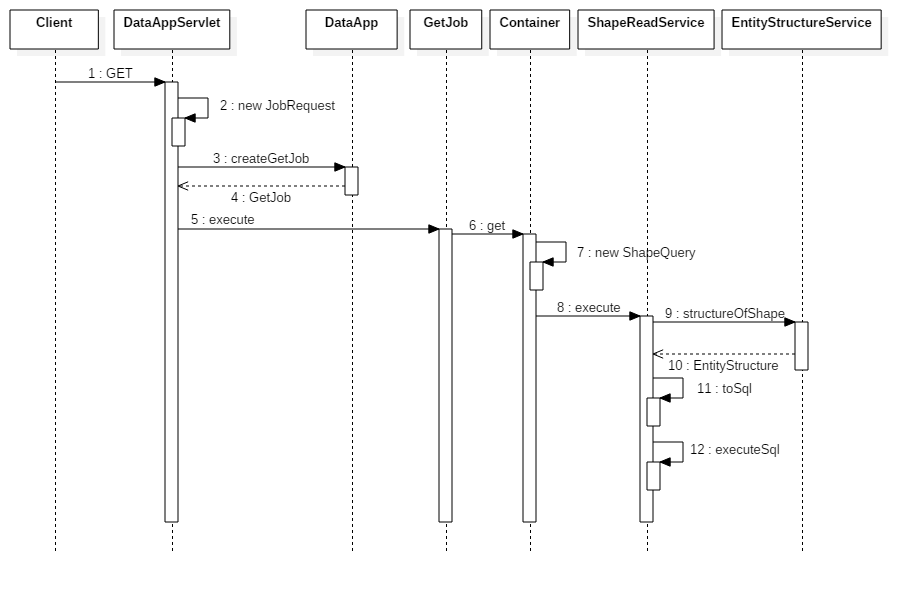
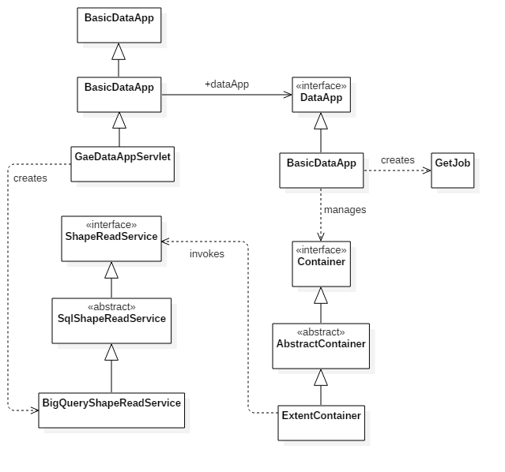

The Konig framework includes a component that implements a REST API for
data access.  This article provides an overview of that component.

The following sequence diagram shows the basic flow during a GET request.

1. The client issues an HTTP GET request to retrieve some data.
2. The DataAppServlet handles the request.  It begins by translating the `HttpServletRequest` into a `JobRequest`.  The `JobRequest` class exists so that we can decouple from the Servlet API.  (We might want to handle requests using other protocols in the future.)
3. The DataAppServlet delegates all of the work to a `DataApp` instance.  It uses the `DataApp` to construct a `GetJob` from the `JobRequest`.
4. The `DataApp` returns the `GetJob` instance which is a self-contained, executable object.
5. The `DataApp` executes the `GetJob` instance.
6. The `GetJob` instance was initialized with information about the `Container` that holds the requested data.  The `GetJob` instance invokes the `get` method on the `Container` to retrieve the data.
7. The `Container` instantiates a `ShapeQuery` that specifies constraints supplied via path parameters or query parameters.
8. The `Container` invokes the `ShapeReadService`, passing the `ShapeQuery` as an argument to the `execute` method.
9. The `ShapeReadService` uses an `EntityStructureService` to discover what properties must be included in the response (according to the target `Shape`).
10. The `EntityStructureService` returns an `EntityStructure` instance to the `ShapeReadService`.
11. The `ShapeReadService` generates an internal representation of the query (typically SQL) based on the `EntityStructure` and the `ShapeQuery` objects.
12. The `ShapeReadService` executes the query in the backend datastore (BigQuery, Spanner, etc.) and writes the response

The following diagram shows the classes and interfaces involved in the solution.

